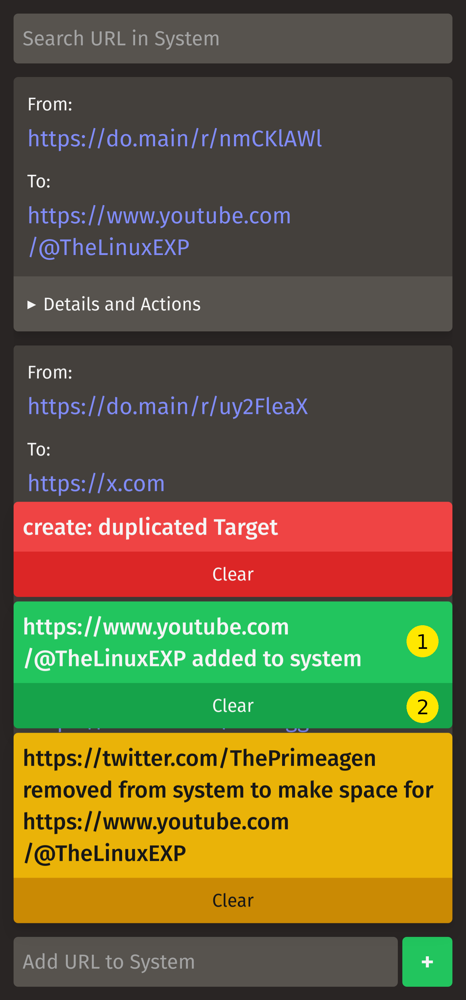
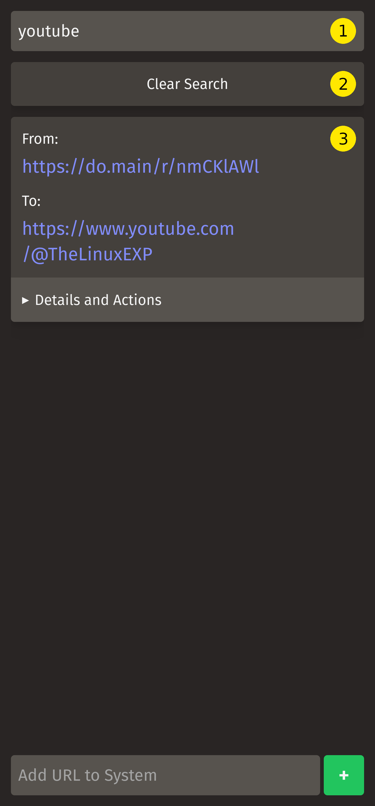

# Shrtnr

A URL Shortener service to practice Message Driven Software Architecture and distributed systems in Go with the ROM Stack

## Design Constrains

The service should only hold a maximum of N short urls. When a new url is added and the service can't store more, the oldest is drop to make space.

> Let's implement some queues

## Setup

Download the javascript dependencies (You can skip this step if you are running the `devcontainer` environment):

```shell
yarn install
```

Now download the go dependencies (You can skip this step if you are running the `devcontainer` environment):

```shell
go mod download
```

Start `vite` dev server:

```shell
yarn dev
```

Create and prepare the database by running the [Migrator](#migrator) service (check [docs](#migrator) for additional configuration):

```shell
go run cmd/migrator/main.go
```

Start the [Management](#management) service to serve the management Web UI on http://localhost:3000 (check [docs](#management) for additional configuration):

```shell
go run cmd/management/main.go
```

Start the [Redirector](#redirector) service to listen for redirection calls on http://localhost:4269 (check [docs](#redirector) for additional configuration):

```shell
go run cmd/redirector/main.go
```

## Services

`Shrtnr` is compose of 3 different services.

- **Migrator**: to manage database creation and modification.
- **Management**: The web UI to manage the URLs that are registered in the system.
- **Redirector**: The redirection service that takes the requests and redirects them to the proper target.

### Migrator

Manages the database setup and migrations. You can start it by running:

```shell
go run cmd/migrator/main.go
```

Flags:

- `--db-file-path` defines the location of the SQLite database data file and its name. Default value: `./data/shrtnr.db`

    You can set a custom path by passing the flag like this:

    ```shell
    go run cmd/migrator/main.go --db-file-path=/path/to/your/database/file
    ```

*Important:* You need to run this service if you haven't run any `Shrtnr` services before.

### Management

Serves the Web UI to manage all URLs in the system. You can start it by running:

```shell
go run cmd/management/main.go
```

Flags:

- `--env` defines the environment where the application is running. Default value: `development`

    You can change it like this:

    ```shell
    go run cmd/management/main.go --env=environment
    ```
    
    *Important:* If you set it to `production`, you need to bundle the client code before so the build can embed the bundle files in the executable.

- `--port` defines the port where the Web UI server will listen for requests. Default value: `3000`

  You can change it like this:

    ```shell
    go run cmd/management/main.go --port=420
    ```

- `--db-file-path` defines the SQLite database's data file location and name. Default value: `./data/shrtnr.db`

  You can change it like this:

    ```shell
    go run cmd/management/main.go --db-file-path=/path/to/your/database/file
    ```

- `--capacity` defines the limit of URLs the service can store. Default value: `2500`

  You can change it like this:

    ```shell
    go run cmd/management/main.go --capacity=69
    ```

- `--search-term-limit` defines the limit of term results the search cache returns when called. Default value: `10`

  You can change it like this:

    ```shell
    go run cmd/management/main.go --search-term-limit=42
    ```

- `--search-concurrency` defines the limit of concurrent processes when checking each trie cache for search terms. Default value: `30`

  You can change it like this:
  
    ```shell
    go run cmd/management/main.go --search-concurrency=1977
    ```

- `--redirect-service-url` defines the redirector service's URL. Default value: `http://localhost:4269`

    You can change it like this:

    ```shell
    go run cmd/management/main.go --redirect-service-url=https://do.main
    ```

### Redirector

Serves the Web Service to handle redirects of URLs stored in the system. You can start it by running:

```shell
go run cmd/redirector/main.go
```

Flags:

- `--env` defines the environment where the application is running. Default value: `development`

  You can change it like this:

    ```shell
    go run cmd/redirector/main.go --env=environment
    ```

  *Important:* If you set it to `production`, you need to bundle the client code before so the build can embed the bundle files in the executable.

- `--port` defines the port where the web server will listen for requests. Default value: `4269`

  You can change it like this:

    ```shell
    go run cmd/redirector/main.go --port=420
    ```

- `--db-file-path` defines the SQLite database's data file location and name. Default value: `./data/shrtnr.db`

  You can change it like this:

    ```shell
    go run cmd/redirector/main.go --db-file-path=/path/to/your/database/file
    ```

## Usage

> ### Disclaimer
> I do not recommend to open any of the services to the internet. I didn't implement User Auth on purpose. I designed this system as an exercise to develop something simple with the ROM Stack and *maybe* use it as part of my Home Lab network. - [@NordGus](https://github.com/NordGus)

### The UI

The following screenshots shows the UI you will normally see when there's URLs in the system.


1. Search Input.
2. URL Information Card.
   1. Redirector Link.
   2. Target Link.
   3. `Details and Actions` dropdown trigger.
3. New URL Form.
   1. Target Link.
   2. Submit Button.

**Expanded URL Information Card's `Details and Actions`:**


1. Timestamp for when the URL was added to the system.
2. Delete URL Action Button.

**Notification Toasts:**



1. Notification Message.
2. Clear Button.

Each color communicates what type of notification the system is communicating to you:

- **Red:** An error happened while executing the requested action.
- **Yellow:** An expected non-intuitive side effect happened while executing the requested action.
- **Green:** The requested action succeeded.

**Search:**



1. Search Input.
2. Clear Search Button.
3. Results URL Information Cards.

### How to Search

Simply focus the Search Input and start writing.

You can search using the full Target URL, or the Shortcut URL, or the URL without the schema.

After a 500ms delay the HTMX client will send a `POST` request to the server asking for the matching entries.

To return to the normal list view, simply press the `Clear Search Button`. 

**Drawbacks:** 

- Because I implement the search using simple Tries
  - The search is case-sensitive.
  - It doesn't respond to partial full Target URL (You need to pass the full Target). 
  - It doesn't support partial matching.
- To return to the normal list view you need to press the `Clear Search Button`.

Despise these drawbacks is serviceable and quick because is performed in memory and without serialization from another source into a Go struct.

### How to add a URL to the System

Focus the Target Link input at the bottom of the screen, paste or write the URL you want to add to the system and press `+`.

The HTMX client sends a `PUT` request to the server for entry creation.

> **Important:** The client generates an `ID`, using `uuid v4`, and a system `UUID`, a random 8 character string that contains numbers from 0-9, letters from a-z and A-Z, for the entry. 

The server validates that the `ID` complies with the `uuid v4` spec, the `UUID` is correct and is unique, and the Target Link is actually a valid URI and is also unique to the system. If the entry fails any of these validations, it would stop and send an error and stop further actions and sends an Error notification toast.

> If the server raises an error indicating that neither the `ID` or the `UUID` is not unique you need to refresh the page to reset this values. I haven't implemented the errors and system  to identify this and force the server to render the form template in the required way for the client code to refresh this values.

Then the server will check if it can be added to the database without opening space for it. 

If the server needs to open space for it, it would delete the oldest entry in the system and sends an event to the system indicating that the entry was deleted, so it can be removed from all relevant caches.

Then the system persists the new entry, sends a message to the system that the entry has been persisted, so it can be added to the relevant caches.

Then is added to the Queue cache that controls the removal order from the system.

Finally, it sends a Success notification toast indicating success. If the system needed to remove an older entry to make space for the new entry, it will additionally send a Warning notification toast, indicating that it deleted an older entry to open space for the new entry. 

### How to Delete a URL from the System

### How to interact with Toasts

You can dismiss Toasts by pressing the `Clear Button` under each Toast. 

Toast disappear automatically from the screen after 3 seconds if you don't clear them yourself by pressing the `Clear Button`.

---
Built with the ROM Stack
