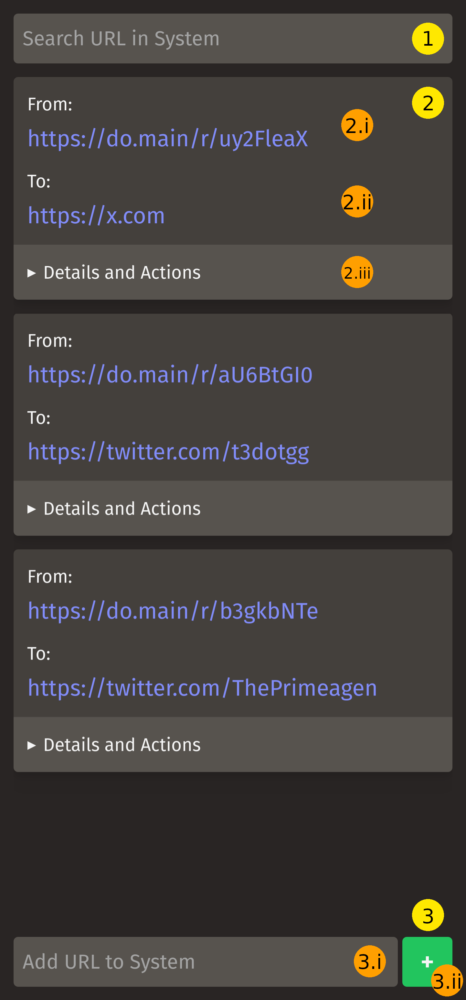
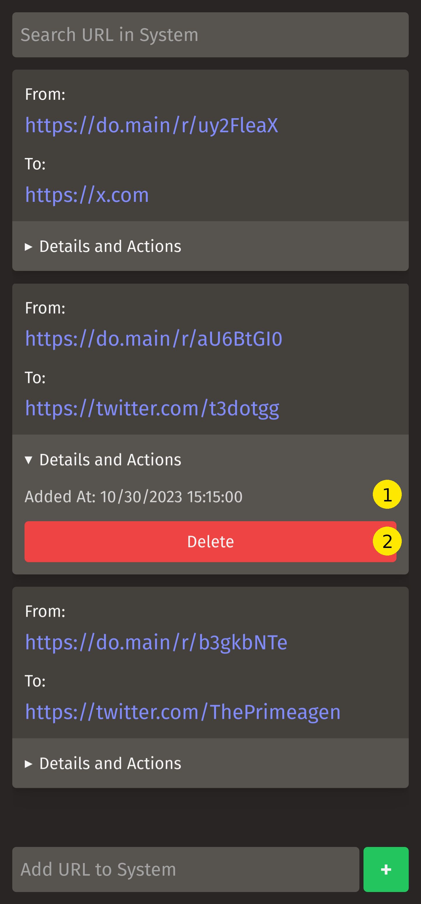
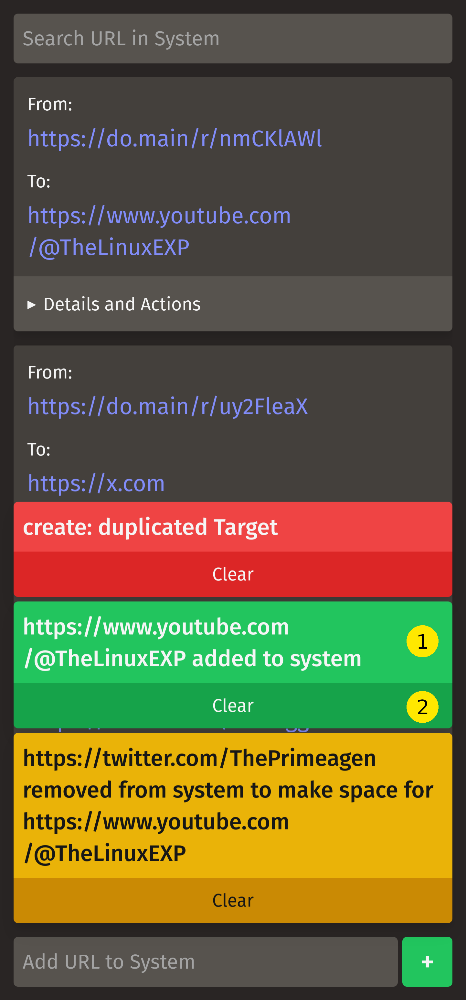
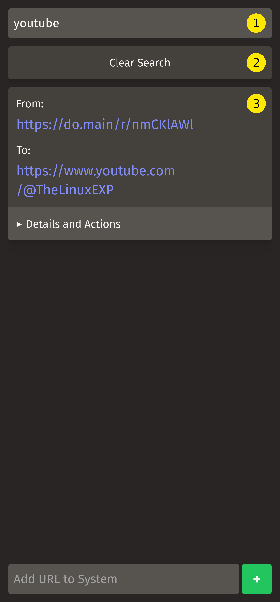

# Management Service

A way for the administrator to interact with the system via an easy-to-use web interface.

## The UI

### Main UI

1. Search Input.
2. URL Information Card.
    1. Redirector Link.
    2. Target Link.
    3. `Details and Actions` dropdown trigger.
3. New URL Form.
    1. Target Link.
    2. Submit Button.

### Expanded URL Information Card's `Details and Actions`

1. Timestamp for when the URL was added to the system.
2. Delete URL Action Button.

### Notification Toasts

1. Notification Message.
2. Clear Button.

Each color communicates what type of notification the system is communicating to you:

- **Red:** An error happened while executing the requested action.
- **Yellow:** An expected non-intuitive side effect happened while executing the requested action.
- **Green:** The requested action succeeded.

### Search

1. Search Input.
2. Clear Search Button.
3. Results URL Information Cards.

## Manual

### How to Search

Simply focus the Search Input and start writing.

You can search using the full Target URL, or the Shortcut URL, or the URL without the schema.

After a 500ms delay the HTMX client will send a `POST` request to the server asking for the matching entries.

To return to the normal list view, simply press the `Clear Search Button`.

**Drawbacks:**

- Because I implement the search using simple Tries
    - The search is case-sensitive.
    - It doesn't respond to partial full Target URL (You need to pass the full Target).
    - It doesn't support partial matching.
- To return to the normal list view you need to press the `Clear Search Button`.

Despise these drawbacks is serviceable and quick because is performed in memory and without serialization from another source into a Go struct.

### How to add a URL to the System

Focus the Target Link input at the bottom of the screen, paste or write the URL you want to add to the system and press `+`.

The HTMX client sends a `PUT` request to the server for entry creation.

> **Important:** The client generates an `ID`, using `uuid v4`, and a system `UUID`, a random 8 character string that contains numbers from 0-9, letters from a-z and A-Z, for the entry.

The server validates that the `ID` complies with the `uuid v4` spec, the `UUID` is correct and is unique, and the Target Link is actually a valid URI and is also unique to the system. If the entry fails any of these validations, it would stop and send an error and stop further actions and sends an Error notification toast.

> If the server raises an error indicating that neither the `ID` or the `UUID` is not unique you need to refresh the page to reset this values. I haven't implemented the errors and system  to identify this and force the server to render the form template in the required way for the client code to refresh this values.

Then the server will check if it can be added to the system without opening space for it.

If the server needs to open space for it, it would delete the oldest entry in the system and raises an event to the system indicating that the entry was deleted, so it can be removed from all relevant caches.

Then the system persists the new entry, raises an event to the system that the entry has been persisted, so it can be added to the relevant caches.

Then is added to the Queue cache that controls the removal order from the system.

Finally, it sends a Success notification toast indicating success. If the system needed to remove an older entry to make space for the new entry, it will additionally send a Warning notification toast, indicating that it deleted an older entry to open space for the new entry.

### How to Delete a URL from the System

Expand the `Details and Actions` section of the URL card you want to delete and press the `Delete` button.

The HTMX client sends a `DELETE` request to the server to delete the entry you want to delete.

The server validates that the `ID` is a valid `uuid v4`. If it isn't the server stops any further actions and returns an Error notification toast indicating such error.

Then it validates that the requested entry is present in the system. If it isn't the server stops any further actions and returns an Error notification toast indicating such error.

After that it deletes the entry from the system and raises an event to the system to indicate that the entry was deleted, so it can be removed from all relevant caches.

Finally, it sends a Success notification toast indicating success.

### How to interact with Toasts

You can dismiss Toasts by pressing the `Clear Button` under each Toast.

Toast disappear automatically from the screen after 3 seconds if you don't clear them yourself by pressing the `Clear Button`.

---
> ### Disclaimer
> I do not recommend to open any of the services to the internet. I didn't implement User Auth on purpose. I designed this system as an exercise to develop something simple with the ROM Stack and *maybe* use it as part of my Home Lab network. - [@NordGus](https://github.com/NordGus)

*Built with the ROM Stack*
